# Onix AI Agent Data Flow Diagram

```mermaid
graph TB
    %% User Interface Layer
    subgraph UI["User Interface Layer"]
        Login["Login/Signup Screen"]
        Chat["Chat Interface"]
        DocMgmt["Document Management"]
        PresentGen["Presentation Generator"]
        Settings["Settings Panel"]
    end

    %% Authentication Layer
    subgraph Auth["Authentication Layer"]
        FireAuth["Firebase Auth"]
        AuthGuard["Auth Guard"]
        Session["Session Management"]
    end

    %% State Management Layer
    subgraph State["State Management (Zustand)"]
        GlobalState["Global State Store"]
        subgraph StateSlices["State Slices"]
            UserState["User State"]
            ChatState["Chat State"]
            DocState["Document State"]
            PrefState["Preferences State"]
        end
        Persistence["Local Storage Persistence"]
    end

    %% Data Processing Layer
    subgraph Processing["Data Processing Layer"]
        ChatProcessor["Chat Processor"]
        subgraph Modes["Chat Modes"]
            BasicChat["Basic Chat"]
            RAGMode["RAG Search"]
            SumMode["Summarization"]
            SearchMode["Search Mode"]
        end
        DocProcessor["Document Processor"]
        PresentProcessor["Presentation Processor"]
    end

    %% Backend Services Layer
    subgraph Backend["Backend Services"]
        FireStore["Firestore Database"]
        subgraph Collections["Collections"]
            Users["Users Collection"]
            Chats["Chats Collection"]
            Messages["Messages Collection"]
            Docs["Documents Collection"]
            Prefs["Preferences Collection"]
        end
        APIService["AI API Service"]
        ChunkAPI["/v1/chunks API"]
    end

    %% Component Interactions
    subgraph Components["Component Interactions"]
        ChatWindow["Chat Window"]
        MessageList["Message List"]
        InputArea["Input Area"]
        DocViewer["Document Viewer"]
        PresentBuilder["Presentation Builder"]
    end

    %% Data Flow Connections
    
    %% Authentication Flow
    Login --> FireAuth
    FireAuth --> AuthGuard
    AuthGuard --> Session
    Session --> UserState
    
    %% Chat Flow
    Chat --> ChatProcessor
    ChatProcessor --> Modes
    Modes --> APIService
    APIService --> ChatState
    ChatState --> MessageList
    
    %% Document Flow
    DocMgmt --> DocProcessor
    DocProcessor --> Docs
    DocProcessor --> ChunkAPI
    ChunkAPI --> DocViewer
    
    %% Presentation Flow
    PresentGen --> PresentProcessor
    PresentProcessor --> PresentBuilder
    PresentBuilder --> Chats
    
    %% State Management Flow
    GlobalState --> StateSlices
    StateSlices --> Persistence
    StateSlices --> Components
    
    %% Database Interactions
    UserState --> Users
    ChatState --> Messages
    DocState --> Docs
    PrefState --> Prefs
    
    %% Component Updates
    Components --> GlobalState
    GlobalState --> FireStore
    FireStore --> GlobalState

    %% Mode-specific Flows
    RAGMode --> DocProcessor
    SearchMode --> ChunkAPI
    SumMode --> APIService
    BasicChat --> APIService

    %% Settings Flow
    Settings --> PrefState
    PrefState --> Persistence

    %% Real-time Updates
    FireStore -.-> GlobalState
    GlobalState -.-> Components
    
    %% Error Handling
    APIService --> GlobalState
    ChunkAPI --> GlobalState

    classDef primary fill:#f76361,stroke:#333,stroke-width:2px,color:white;
    classDef secondary fill:#884f83,stroke:#333,stroke-width:2px,color:white;
    classDef tertiary fill:#263b58,stroke:#333,stroke-width:2px,color:white;
    
    class Login,Chat,DocMgmt,PresentGen,Settings primary;
    class FireAuth,AuthGuard,Session secondary;
    class GlobalState,StateSlices,Persistence tertiary;
    class ChatProcessor,DocProcessor,PresentProcessor primary;
    class APIService,ChunkAPI,FireStore secondary;
    class Components tertiary;
```

## Data Flow Description

### 1. Authentication Flow
- User initiates login/signup through the UI
- Firebase Auth handles authentication
- AuthGuard validates session
- User state is updated in Zustand store
- Session details persist in local storage

### 2. Chat Flow
- User input processed by Chat Processor
- Routed to appropriate chat mode
- API calls made to AI service
- Responses stored in Chat State
- Messages rendered in UI components
- Real-time sync with Firestore

### 3. Document Processing Flow
- Documents uploaded through Document Management
- Processed by Document Processor
- Stored in Firestore Documents collection
- Chunks API processes document sections
- Results displayed in Document Viewer
- Context maintained in Document State

### 4. Presentation Generation Flow
- User configures presentation settings
- Presentation Processor handles generation
- Integrates with Chat and Document data
- Builds presentation through components
- Stores results in Firestore
- Updates UI through state management

### 5. State Management Flow
- Global state manages all data flows
- State slices handle specific domains
- Local storage persistence for preferences
- Real-time updates from Firestore
- Component updates through state subscriptions

### 6. Error Handling Flow
- API errors captured in state
- UI updates reflect error states
- Error boundaries protect component tree
- Retry mechanisms for failed operations
- User notifications through toast system

### 7. Real-time Updates
- Firestore listeners maintain sync
- State updates trigger UI refreshes
- Optimistic updates for better UX
- Conflict resolution handling
- Background sync for offline support

### 8. Settings and Preferences
- User preferences stored in state
- Synced with Firestore
- Persisted in local storage
- Applied through component system
- Real-time UI updates on changes